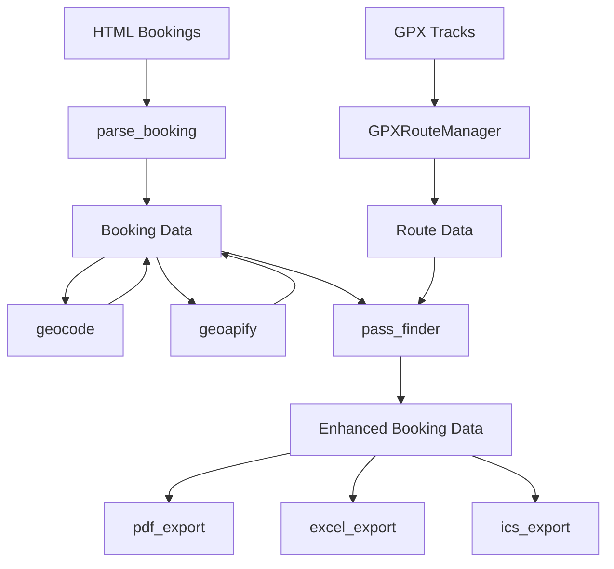

# Architecture Overview

## System Components

## Data Flow

1. **Input Processing**
   - `parse_booking.py`: Extracts booking info from HTML confirmations.
   - `geocode.py`: Converts addresses to geographic coordinates using Nominatim or Photon.
   - `geoapify.py`: Finds nearby tourist attractions using Geoapify API.

2. **Route Calculation**
   - `GPXRouteManager`: Chains GPX tracks between hotel locations, handles track discovery and merging.
   - `brouter.py`: Fills gaps between tracks or from hotels to tracks using offline BRouter engine.
   - `elevation_calc.py`: Computes ascent/descent statistics for the generated routes.

3. **Output Generation**
   - `pdf_export.py`: Creates a detailed printable itinerary with maps and elevation profiles.
   - `excel_export.py`: Generates an editable spreadsheet with tour details and hyperlinks.
   - `ics_export.py`: Exports tour segments as calendar events.

## Key Abstractions

- **Booking**: Pydantic model representing an accommodation with dates, location, and amenities.
- **RoutePosition**: Dataclass representing a point in a GPX track (file and index).
- **RouteStatistics**: Dataclass for accumulating distance and elevation data.
- **RouteContext**: Dataclass for managing state during route discovery.
- **Pass**: Mountain pass with associated track data.
