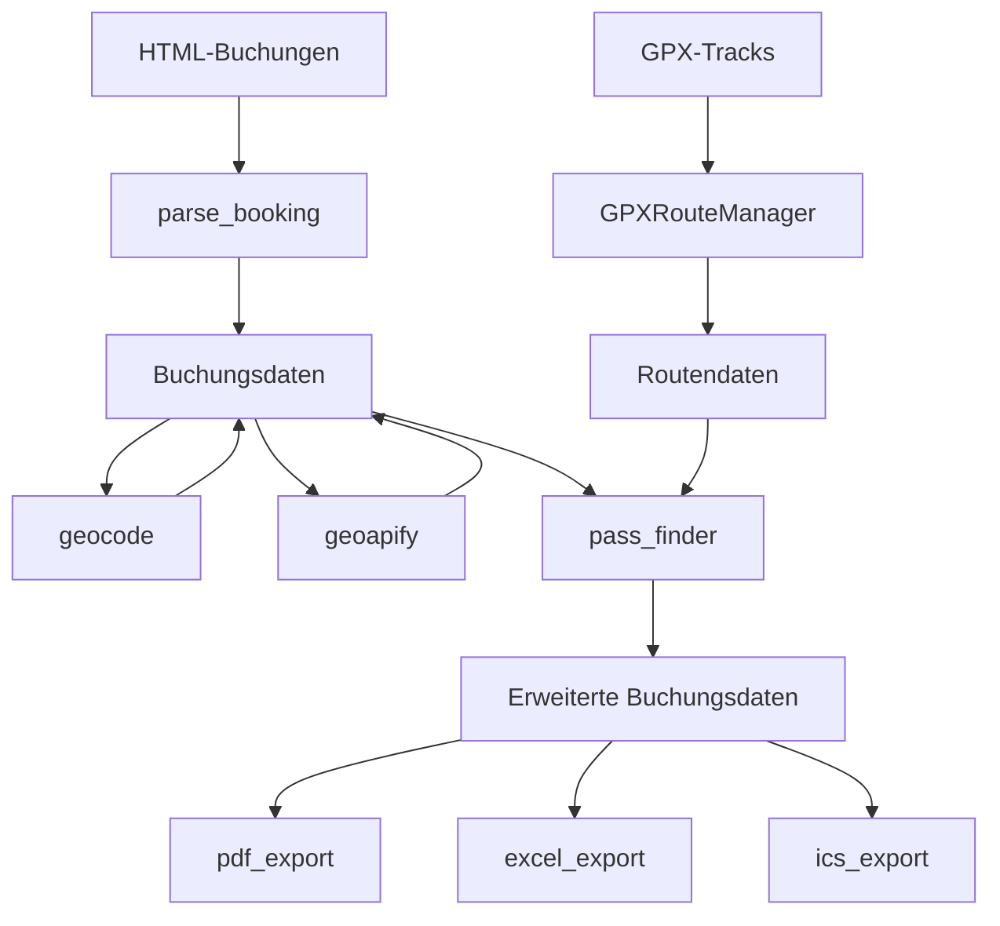
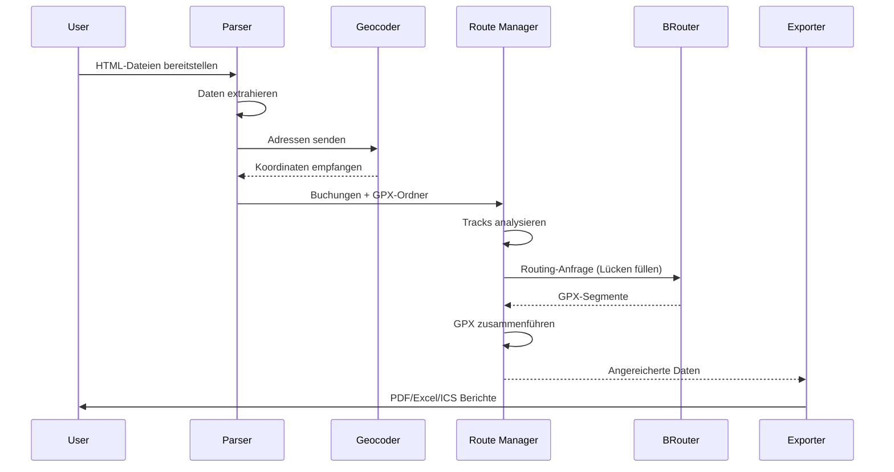
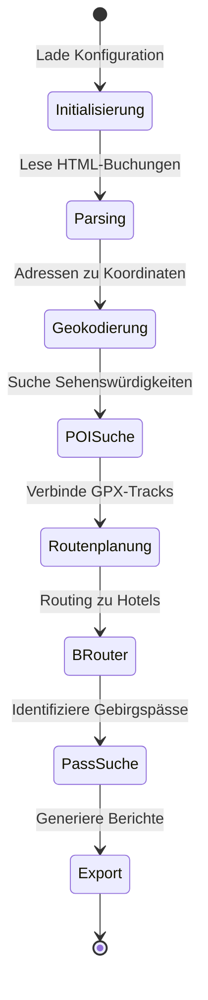

# Architektur-Übersicht

## Systemkomponenten

Das System besteht aus mehreren Modulen, die zusammenarbeiten, um aus Buchungsbestätigungen und GPX-Tracks einen vollständigen Reiseplan zu erstellen.

## Datenfluss-Diagramm

Der Datenfluss folgt einem sequentiellen Prozess von der Extraktion bis zum Export.

## Prozess-Lebenszyklus

## Kernabstraktionen

- **Booking**: Pydantic-Modell, das eine Unterkunft mit Daten, Ort und Ausstattung darstellt.
- **RoutePosition**: Dataklasse, die einen Punkt in einem GPX-Track darstellt (Datei und Index).
- **RouteStatistics**: Dataklasse zur Akkumulation von Distanz- und Höhendaten.
- **RouteContext**: Dataklasse zur Verwaltung des Zustands während der Routensuche.
- **Pass**: Gebirgspass mit zugehörigen Track-Daten.
