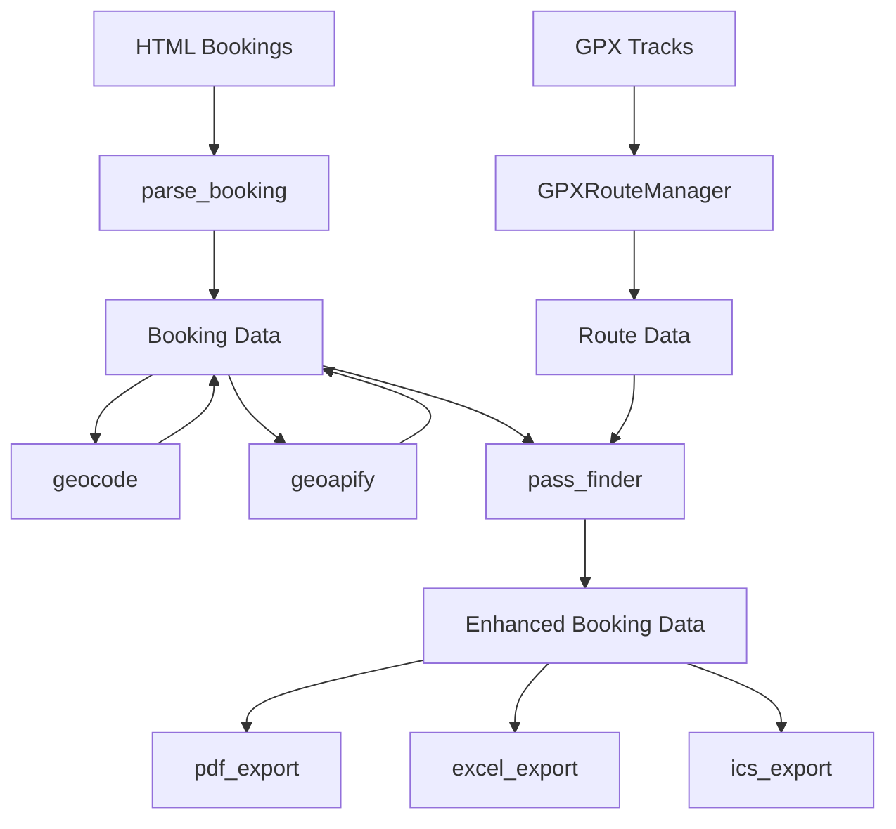
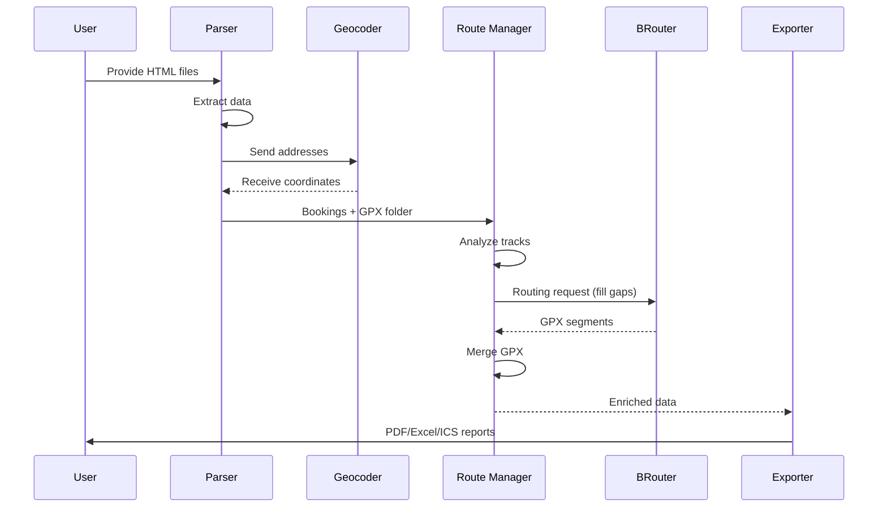
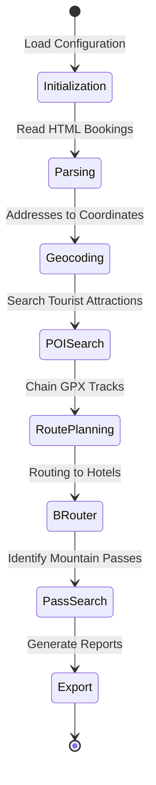

# Architecture Overview

## System Components

The system consists of several modules working together to create a complete travel plan from booking confirmations and GPX tracks.

## Data Flow Diagram

Data flow follows a sequential process from extraction to export.

## Process Lifecycle

## Key Abstractions

- **Booking**: Pydantic model representing an accommodation with dates, location, and amenities.
- **RoutePosition**: Dataclass representing a point in a GPX track (file and index).
- **RouteStatistics**: Dataclass for accumulating distance and elevation data.
- **RouteContext**: Dataclass for managing state during route discovery.
- **Pass**: Mountain pass with associated track data.
